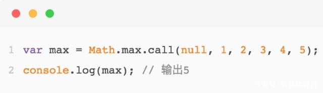
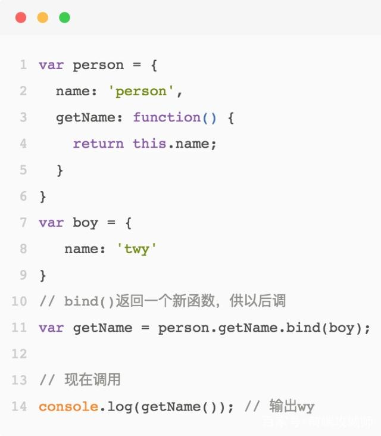

# JavaScript中的call,apply和bind

js中的 call() ,  apply() 和 bind() 是Function.prototype下的方法，都是用于改变函数运行时上下文，最终的返回值是你调用的方法的返回值，若该方法没有返回值，则返回undefined。这几个方法很好地体现了js函数式语言特性，在js中几乎每一次编写函数式语言风格的代码，都离不开call和apply，能够熟练运用它们，是真正成为一名jser程序员的重要一步。

## apply()

使用 apply， 你可以继承其他对象的方法：

注意这里 apply() 的第一个参数是null，在非严格模式下，第一个参数为null或者undefined时会自动替换为指向全局对象， apply() 的第二个参数为数组或类数组。

## call()

call() 是 apply() 的一颗语法糖，作用和 apply() 一样，同样可实现继承，唯一的区别就在于 call() 接收的是参数列表，而apply()则接收参数数组。

## bind()

bind() 的作用与 call() 和 apply() 一样，都是可以改变函数运行时上下文，区别是 call() 和 apply() 在调用函数之后会立即执行，而 bind() 方法调用并改变函数运行时上下文后，返回一个新的函数，供我们需要时再调用。

## 如何选用

- 如果不需要关心具体有多少参数被传入函数，选用 apply()；

- 如果确定函数可接收多少个参数，并且想一目了然表达形参和实参的对应关系，用 call()；

- 如果我们想要将来再调用方法，不需立即得到函数返回结果，则使用 bind() ;

## 总结

- call() 、apply() 和 bind() 都是用来改变函数执行时的上下文，可借助它们实现继承；

- call() 和 apply() 唯一区别是参数不一样，call()是apply()的语法糖；

- bind() 是返回一个新函数，供以后调用，而apply()和call()是立即调用。

