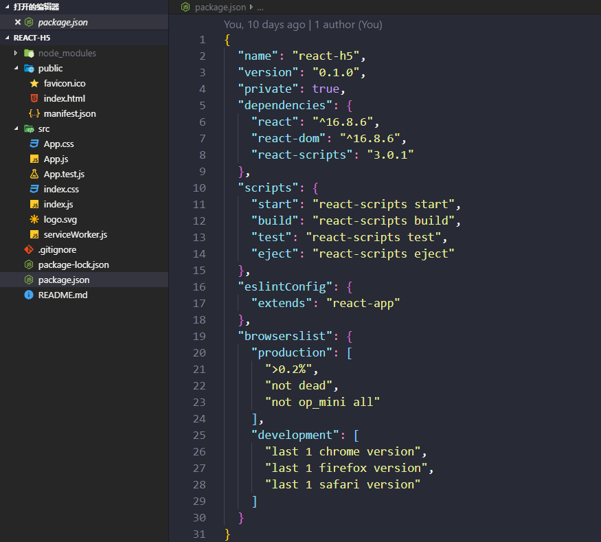

# react 全家桶介绍



```
├── package-lock.json // 锁定安装时的包的版本号，并且需要上传到git，以保证其他人在npm install时大家的依赖能保证一致,对整个文件的描述,为的是让开发者知道只要你保存了源文件，到一个新的机器上、或者新的下载源，只要按照这个package-lock.json所标示的具体版本下载依赖库包，就能确保所有库包与你上次安装的完全一样，它是npm install自动生成的一文件
├── package.json // 对整个应用程序的描述,应用名称,版本号,一些依赖包,以及项目的启动,打包，测试配置，锁定大版本
├── public
│ ├── favicon.ico // icon图标
│ ├── index.html // 主页面,首页模板
│ └── manifest.json // 定义成app应用的方式来使用,快捷方式的图标,可以配置icons，定义快捷方式的图标,定义快捷方式跳转的网址到哪里,主题颜色,用于指定应用的显示名称、图标、应用入口文件地址及需要使用的设备权限等信息，类似于android里面的manifest.xlm配置文件
├── README.md // 说明文档
└── src // 源码目录
    ├── App.css // App应用组件的样式
    ├── App.js // App应用组件的逻辑代码,构成一个react组件的基本组成部分
    ├── App.test.js // App自动化测试文件
    ├── index.css // 首页入口index的样式
    ├── index.js // 整个程序运行的入口文件,这个应用所做的事情是,只是渲染一个名叫App的组件，App组件在同目录下的App.js文件中定义
    ├── logo.svg // 图标,资源
    └── serviceWorker.js // 引入这个是为了帮助我们借助网页去写手机app应用这样的一个功能,如果上传到https协议的服务器上,在断网的情况下,依然可以看到之前的页面
```

这是简单的基础项目，他的核心：react / react-dom 两个框架
特点：

1. 生成项目后，脚手架为了“优雅”，隐藏了所有的webpack相关的配置文件，此时查看文件夹目录，会发现找不到任何webpack配置文件；这也就导致了，如果我们需要在webpack中安装一些自己的loder或者plugin变的很困难；
2. `create-react-app`自动生成的webpack中集成了：eslint（代码检测）、url-loader（图片base64 [小于10000kb的图片]）、babel-loader（ES6和JSX语法解析）、style-loader、css-loader（CSS代码解析）、HtmlWebpackPlugin（产出HTML插件）等内容；
3. 仅仅是安装了react中最常用的 react / react-dom 组件，其余的并没有安装，所以在项目开发中，我们根据需要，可能还会安装：$ yarn add redux react-redux react-router-dom prop-types 等。

完整的基础项目除了react / react-dom 两个框架,还包含:

- redux
- react-redux
- react-router
- sass /less
- style-component
- history
- fetch
- webpack-dev-server

项目所用到的插件及作用：

### redux

帮你解决state变化和异步, state 可能包括服务器响应、缓存数据、本地生成尚未持久化到服务器的数据，也包括 UI 状态，如激活的路由，被选中的标签，是否显示加载动效或者分页器等。

1. 单一数据源
   整个应用的 state 被储存在一棵 object tree 中，并且这个 object tree 只存在于唯一一个 store 中。
2. State 是只读的
   唯一改变 state 的方法就是触发 action，action 是一个用于描述已发生事件的普通对象。
3. 使用纯函数来执行修改
   为了描述 action 如何改变 state tree ，你需要编写 reducers。
   Reducer 只是一些纯函数，它接收先前的 state 和 action，并返回新的 state。

### react-redux

Redux 的作者封装了一个 React 专用的库 React-Redux，将所有组件分成两大类：UI 组件（presentational component）和容器组件（container component）。

1. UI 组件有以下几个特征。

   - 只负责 UI 的呈现，不带有任何业务逻辑
   - 没有状态（即不使用this.state这个变量）
   - 所有数据都由参数（this.props）提供
   - 不使用任何 Redux 的 API

   下面就是一个 UI 组件的例子：

   ```jsx
const Title = value => <h1>{value}</h1>;
   ```

   因为不含有状态，UI 组件又称为"纯组件"，即它纯函数一样，纯粹由参数决定它的值。

2. 容器组件的特征恰恰相反

   - 负责管理数据和业务逻辑，不负责 UI 的呈现
   - 带有内部状态
   - 使用 Redux 的 API

3. connect()

   React-Redux 提供connect方法，用于从 UI 组件生成容器组件。connect的意思就是将这两种组件连起来。

   ```jsx
   import { connect } from 'react-redux'
   const VisibleTodoList = connect()(TodoList);
   ```

   上面代码中，TodoList是 UI 组件，VisibleTodoList就是由 React-Redux 通过connect方法自动生成的容器组件。

   但是，因为没有定义业务逻辑，上面这个容器组件毫无意义，只是 UI 组件的一个单纯的包装层。为了定义业务逻辑，需要给出下面两方面的信息。

   1. 输入逻辑：外部的数据（即state对象）如何转换为 UI 组件的参数；
   2. 输出逻辑：用户发出的动作如何变为 Action 对象，从 UI 组件传出去。

   因此，connect方法的完整 API 如下：

   ```jsx
   import { connect } from 'react-redux'
   const VisibleTodoList = connect(
     mapStateToProps,
     mapDispatchToProps
   )(TodoList)
   ```

   上面代码中，connect方法接受两个参数：mapStateToProps和mapDispatchToProps。它们定义了 UI 组件的业务逻辑。前者负责输入逻辑，即将state映射到 UI 组件的参数（props），后者负责输出逻辑，即将用户对 UI 组件的操作映射成 Action。

### React-Router

基本用法

1. 路由定义(摘要: Router, Route)

   在一个路由系统中，我们需要定义好路由表。我们需要用Router组件包含我们的路由表，通过Route来声明单个的路由。同时，每个路由应该与它所属的组件一一对应

   ```jsx
   render((
     <Router> //开始创建路由表
       <Route path="/" component={App}> //声明每一个路由
         <Route path="/about" component={About}/>
         <Route path="users" component={Users}> //每个路由
           <Route path=":id" component={User}/> //对应一个Component
         </Route>
       </Route>
     </Router>
   ), document.getElementById('example'))
   
   //其他定义路由表的方法
   
   import routes from './config/routes'
   render(<Router history={browserHistory} routes={routes}/>, document.getElementById('example'))
   ```

2. 路由嵌套(摘要: IndexRouter, this.props.children)
   如何实现路由的嵌套呢，与Angular路由一样，路由的嵌套需要两个条件：

   - 在创建路由表的时候就声明好嵌套的规则(ng中的stateProvider)；

   - 需要有一个view来安放所要嵌套的子页面(ng中的ui−view)。其中，我们还可以在嵌套层的首个路由声明中，使用IndexRoute来声明该路由下的默认路由(类似于ng中stateProvider)。

     ```jsx
     //有嵌套与默认页面的路由表
     render((
       <Router>
         <Route path="/" component={App}>
           <IndexRoute component={Index}/> //设置默认页面
           <Route path="/about" component={About}/>
           <Route path="users" component={Users}>
             <IndexRoute component={UsersIndex}/> //设置默认页面
             <Route path=":id" component={User}/>
           </Route>
         </Route>
       </Router>
     ), document.getElementById('example'))
     
     //一个用于安放子页(子路由)的view
     class Users extends React.Component {
       render() {
         return (
           <div>
             <h2>Users</h2>
             {this.props.children} //此处相当于<ui-view>
           </div>
         )
       }
     }
     ```

3. 路由跳转(摘要: Link，to)
   我们需要一个Link组件帮助我们实现路由的的跳转

   ```jsx
   <li><Link to="/users" >/users</Link></li>
   ```

   最终Link组件会被渲染为标签。to属性是我们所要跳转的路由pathname(类似于ng中的ui-sref / href)

   3.1 父子路由的参数穿透传递(摘要: to = {`/xx/${xxx}/`} )

   若父路由中包含不确定参数，而我们又想把该参数往下级传递，这时候我们需要这样子做
   //路由配置

   ```jsx
   <Route path="user/:userID" component={User}>
   	<Route path="tasks/:taskID" component={Task} />
   	<Redirect from="todos/:taskID" to="tasks/:taskID" />
   </Route>
   //子级路由
   <li><Link to={`/user/${userID}/tasks/foo`} activeClassName="active">foo task</Link></li>
   ```

   3.2 带参数的路由跳转

   ```jsx
   <li>
       <Link 
           to={ pathname: '/users/ryan', query: { foo: 'bar' } }
           activeStyle={ACTIVE}>
           /users/ryan?foo=bar
       </Link>
   </li>
   ```

   3.3 函数内跳转(摘要: this.context.router.push(’/’))

   > this.context.router.push(’/’) ，注：这个写法会把跳转载入浏览器历史，若不想留下历史记录则可以 this.context.router.replace(’/’)

   带有动画效果的路由切换(摘要: ReactCSSTransitionGroup)
   当我们需要在路由切换时带有一定的动画效果时，我们便需要 react-addons-css-transition-group 这个插件了。使用ReactCSSTransitionGroup组件来包含我们需要呈现动画效果的view

   ```jsx
   class App extends Component {
     render() {
       return (
         <div>
           <ul>
             <li><Link to="/page1">Page 1</Link></li>
             <li><Link to="/page2">Page 2</Link></li>
           </ul>
   
           <ReactCSSTransitionGroup
               component="div"
               transitionName="example"
               transitionEnterTimeout={500}
               transitionLeaveTimeout={500}>
             {React.cloneElement(this.props.children, {
               key: this.props.location.pathname
             })}
           </ReactCSSTransitionGroup>
           // 克隆所有子节点，单独的{this.props.children}没有动画效果
         </div>
       )
     }
   }
   ```

   路由的权限控制(摘要: onEnter、context.router)
   单页应用路由的权限控制的基本思路是：监听路由的改变，每当路由将要发生改变，我们就使用一个中间服务(该服务介于上一级路由和将要到达路由之间启动)，来判断我们是否有进入这个路由的权限，有的话直接进入，没有的话就redirect。在React中，为某个路由进行权限监听的方式是onEnter ，该onEnter属性对应连着一个具有判断权限的中间服务。我们通过上一级路由来启动这个服务。假设我们需要从`/form`到`/page`之间做一个判断，在`/form`中填写特定字段后才能成功跳转，否则redirect到`/error`。

   ```jsx
   //form
   const Form = createClass({
     //省略部分代码
     submitAction(event) {
       event.preventDefault();
       //通过context传输数据
       //通过url的query字段传输数据
       //也可以通过制定其他服务来传输数据
       this.context.router.push({
         pathname: '/page',
         query: {
           qsparam: this.state.value
         }
       })
     },
     render() {
       return (
         <form onSubmit={this.submitAction}>
           //省略部分代码
           <button type="submit">Submit </button>
         </form>
       )
     }
   })
   
   //路由权限控制
   <Route path="page" component={Page} onEnter={requireCredentials}/>
   
   //权限控制的中间服务
   function requireCredentials(nextState, replace, next) {
     //获取传输过来的数据
     if (query.qsparam) {
       serverAuth(query.qsparam)
       .then(
         () => next(),//成功,通过next()成功跳转
         () => {
           replace('/error')//重定向
           next()
         }
       )
     } else {
       replace('/error')
       next()
     }
   }
   ```

   其中，onEnter所指向的函数是 type EnterHook = (nextState: RouterState, replace: RedirectFunction, callback?: Function) => any; 其中，nextState作为第一个参数，其所带的信息有如下：

   ```jsx
   type RouterState = {
     location: Location;
     routes: Array<Route>;
     params: Params;
     components: Array<Component>;
   };
   ```

   其中，replace函数一旦被使用到，则在函数内部跳转到一个新url，返回时也要带上必要的信息，如下

   ```jsx
   type RedirectFunction = (state: ?LocationState, pathname: Pathname | Path, query: ?Query) => void;
   ```

   路由离开确认(摘要: componentWillMount, this.context.router.setRouteLeaveHook)　
   若我们需要在路由切换，在离开当前页面的时候做一些确认工作，我们可以通过setRouteLeaveHook函数，为离开前执行一些操作

   ```jsx
   //Component内部
     componentWillMount() {
       this.context.router.setRouteLeaveHook(
         this.props.route,
         this.routerWillLeave
       )
     }
     
     routerWillLeave() {
       if (xxx)
        //...
     },
   ```

   根据路由按需加载组件
   按需加载在单页应用中的好处不言而喻，按业务模块切分代码能使首次加载资源所需要的时间大大降低，能在一定程度上增强用户体验。但首先我们需要整理一下我们的项目结构(此demo是按路由切分的，另外还能按业务模块进行切分)

### styled-component

样式化组件，主要作用是它可以编写实际的CSS代码来设计组件样式，也不需要组件和样式之间的映射，即创建后就是一个正常的React 组件，并且可以附加样式给当前组件。
几种常用的样式化组件方法:

1. injectGlobal # 编写全局CSS的辅助方法。它不返回组件，而是直接将样式添加到样式表中
   这个跟我们平时在写html页面，会先把一些需要重置浏览器的样式加到页面上的做法类似，主要作用是：重置样式及书写全局可共用的样式

   ```jsx
   import { injectGlobal } from 'styled-components';
   
   injectGlobal`
     @font-face {
       font-family: 'Operator Mono';
       src: url('../fonts/Operator-Mono.ttf');
     }
   
     body {
       margin: 0;
     }
   `;
   ```

2. StyledComponent # 样式化组件声明方式：styled.tagname、styled(Component) 两种方式:

- 直接通过styled点一个元素标签，将button元素转化成样式化组件
- 重写样式化组件的部分样式，比如TomatoButton

3. 另外介绍两种方法:

- `.extend`：创建一个新的StyledComponent并且继承它的规则
  如：TomatoButton继承了Button的样式规则，并使用一些与颜色相关的样式进行扩展（其实就是覆盖了被继承组件的某些样式）。

  ```jsx
  const TomatoButton = Button.extend`    
    color: tomato;
    border-color: tomato;
  `;
  ```

- `.withComponent`：创建一个新的StyledComponent，并应用于其他的标签或组件，且使用相同的样式
  如：用标签替换标签，但还是使用相同的样式，相当于有的样式标签一样都有

  ```jsx
  const Link = Button.withComponent('a')
  ```

### History

>  一个管理js应用session会话历史的js库。它将不同环境（浏览器，node…）的变量统一成了一个简易的API来管理历史堆栈、导航、确认跳转、以及sessions间的持续状态。

#### location

你也可以使用 history对象来的方法来改变当前的location：
一个 history 知道如何去监听浏览器地址栏的变化， 并解析这个 URL 转化为 location 对象， 然后 router 使用它匹配到路由，最后正确地渲染对应的组件。

location对象包括：

- pathname 同window.location.pathname
- search 同window.location.search
- state 一个捆绑在这个地址上的object对象
- action PUSH, REPLACE, 或者 POP中的一个key 唯一ID

#### 常用的三种history

##### hashHistory

不需要服务器配置，在URL生成一个哈希来跟踪状态，通常在测试环境使用，也可以作为发布环境使用。

```jsx
ReactDOM.render((<Provider store={store}><Router history={hashHistory}><Route>//你的route</Route></Router></Provider>),document.getElementById('root'));
import { Provider } from 'react-redux'
import { Router, hashHistory} from 'react-router'
```

##### browserHistory

需要服务器端做配置，路径是真实的URL，是官方推荐首选。

- 客户端配置

  ```jsx
  ReactDOM.render((<Provider store={store}><Router history={browserHistory}><Route>//你的route</Route></Router></Provider>),document.getElementById('root'));
  import { Provider } from 'react-redux'
  import { Router, browserHistory } from 'react-router'
  ```

- 服务端配置

  ```jsx
  // 通常用于加载静态资源app.use(express.static(__dirname + '/public'))
  // 在你应用 JavaScript 文件中包含了一个 script 标签// 的 index.html 中处理任何一个 routeapp.get('*', function (request, response){response.sendFile(path.resolve(__dirname, 'public', 'index.html'))})
  app.listen(port)console.log("server started on port " + port)
  const express = require('express')
  const path = require('path')
  const port = process.env.PORT || 8080
  const app = express()
  ```

##### 为什么browserHistory需要服务端配置

因为真实URL其实是指向服务器资源，比如我们经常使用的API接口，也是一个真实URL的资源路径，当通过真实URL访问网站的时候，第一次访问的是网站的域名，这个时候可以正常加载我们的网站js等文件，而用户手动刷新网页时，由于路径是指向服务器的真实路径，服务器端没有做路由配置，就会导致资源不存在，用户访问的资源不存在，返回给用户的是404错误。
通过hashHistory来生成的URL就不会出现这样的问题，因为他不是指向真实的路由。

### Fetch

被称为下一代Ajax技术,采用Promise方式来处理数据。
Fetch的核心是HTTP Requests，Responses Headers和Bodypayload 的接口抽象，以及一个用于启动异步资源请求的全局fetch方法。

- 上传JSON数据
  使用fetch()开机自检JSON编码的数据。

  ```javascript
  var url = 'https://example.com/profile';
  var data = {username: 'example'};
  
  fetch(url, {
    method: 'POST', // or 'PUT'
    body: JSON.stringify(data), 
    headers: new Headers({
      'Content-Type': 'application/json'
    })
  }).then(res => res.json())
  .catch(error => console.error('Error:', error))
  .then(response => console.log('Success:', response));
  ```

- 传文件
  可以使用 HTML

  ```html
  <input type="file"/> 
  ```

- input 元素、FormData() 和 fetch() 来上载文件。

  ```javascript
  var formData = new FormData();
  var fileField = document.querySelector("input[type='file']");
  
  formData.append('username', 'abc123');
  formData.append('avatar', fileField.files[0]);
  
  fetch('https://example.com/profile/avatar', {
    method: 'PUT',
    body: formData
  })
  .then(response => response.json())
  .catch(error => console.error('Error:', error))
  .then(response => console.log('Success:', response));
  ```

- 提供您自己的请求对象
  您可以使用Request()构造函数创建请求对象，并将其作为fetch()方法参数传入，而不是将要请求的资源的路径传递到 fetch () 调用中。

  ```javascript
  var myHeaders = new Headers();
  var myInit = { method: 'GET',
                 headers: myHeaders,
                 mode: 'cors',
                 cache: 'default' };
  
  var myRequest = new Request('flowers.jpg', myInit);
  
  fetch(myRequest).then(function(response) {
    return response.blob();
  }).then(function(myBlob) {
    var objectURL = URL.createObjectURL(myBlob);
    myImage.src = objectURL;
  });
  ```

  