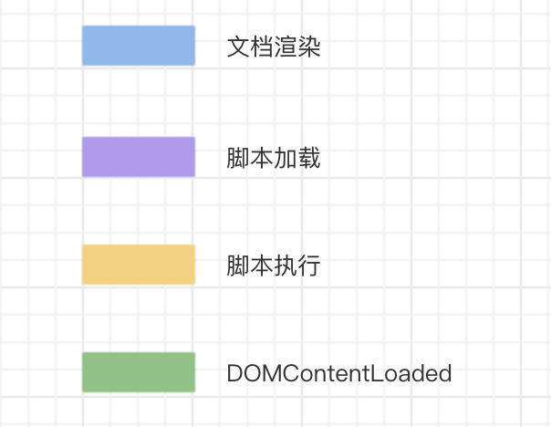
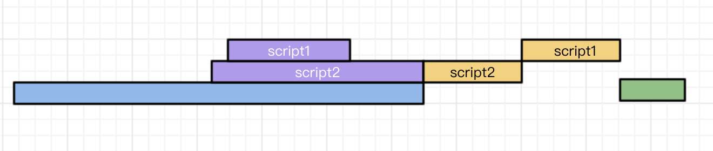
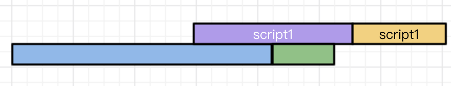

# Script-defer/async

## defer

> 如果`script`标签设置了该属性，则浏览器会异步的下载该文件并且不会影响到后续`DOM`的渲染；
> 如果有多个设置了`defer`的`script`标签存在，则会按照顺序执行所有的`script`；
> `defer`脚本会在文档渲染完毕后，`DOMContentLoaded`事件调用前执行。

## async

> `async`的设置，会使得`script`脚本异步的加载并在允许的情况下执行
> `async`的执行，并不会按着`script`在页面中的顺序来执行，而是谁先加载完谁执行。

## 图解

画一下多个脚本加载时的甘特图，拿四个不同的颜色来标明各自代表的含义

### 普通script

文档解析的过程中，如果遇到`script`脚本，就会停止页面的解析进行下载（但是Chrome会做一个优化，如果遇到`script`脚本，会快速的查看后边有没有需要下载其他资源的，如果有的话，会先下载那些资源，然后再进行下载`script`所对应的资源，这样能够节省一部分下载的时间 `@Update: 2018-08-17`）。
资源的下载是在解析过程中进行的，虽说`script1`脚本会很快的加载完毕，但是他前边的`script2`并没有加载&执行，所以他只能处于一个挂起的状态，等待`script2`执行完毕后再执行。
当这两个脚本都执行完毕后，才会继续解析页面。

### defer

文档解析时，遇到设置了`defer`的脚本，就会在后台进行下载，但是并不会阻止文档的渲染，当页面解析&渲染完毕后。
会等到所有的`defer`脚本加载完毕并按照顺序执行，执行完毕后会触发`DOMContentLoaded`事件。

### async

`async`脚本会在加载完毕后执行。
`async`脚本的加载不计入`DOMContentLoaded`事件统计，也就是说下图两种情况都是有可能发生的

## 推荐的应用场景

### defer

如果你的脚本代码依赖于页面中的`DOM`元素（文档是否解析完毕），或者被其他脚本文件依赖。
**例：**

1. 评论框
2. 代码语法高亮
3. `polyfill.js`

### async

如果你的脚本并不关心页面中的`DOM`元素（文档是否解析完毕），并且也不会产生其他脚本需要的数据。
**例：**

1. 百度统计

如果不太能确定的话，用`defer`总是会比`async`稳定。。。