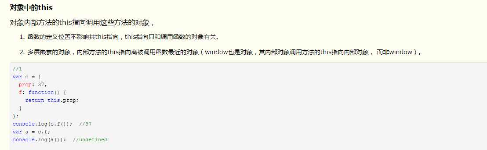

# 面试题汇总

#### 16. 下面代码的输出是什么?

```javascript
function getPersonInfo(one, two, three) {
  console.log(one);
  console.log(two);
  console.log(three);
}
const person = "Lydia";
const age = 21;
getPersonInfo`${person} is ${age} years old`;
```

- A: `Lydia` `21` `["", "is", "years old"]`
- B: `["", "is", "years old"]` `Lydia` `21`
- C: `Lydia` `["", "is", "years old"]` `21`

**答案**: B

如果使用标记的模板字符串，则第一个参数的值始终是字符串值的数组。 其余参数获取传递到模板字符串中的表达式的值！

#### 18. 下面代码的输出是什么?

```javascript
function getAge(...args) {
  console.log(typeof args);
}
getAge(21);
```

- A: `"number"`
- B: `"array"`
- C: `"object"`
- D: `"NaN"`

**答案**: C

扩展运算符（`... args`）返回一个带参数的数组。 数组是一个对象，因此`typeof args`返回`object`。

#### 29. 下面代码的输出是什么?

```javascript
const a = {};
const b = { key: "b" };
const c = { key: "c" };
a[b] = 123;
a[c] = 456;
console.log(a[b]);
```

- A: `123`
- B: `456`
- C: `undefined`
- D: `ReferenceError`

**答案**: B

对象键自动转换为字符串。我们试图将一个对象设置为对象`a`的键，其值为`123`。

但是，当对象自动转换为字符串化时，它变成了`[Object object]`。 所以我们在这里说的是`a["Object object"] = 123`。 然后，我们可以尝试再次做同样的事情。 `c`对象同样会发生隐式类型转换。那么，`a["Object object"] = 456`。

然后，我们打印`a[b]`，它实际上是`a["Object object"]`。 我们将其设置为`456`，因此返回`456`。

#### 33. 下面代码的输出是什么?

```javascript
const person = { name: "Lydia" };
function sayHi(age) {
  console.log(`${this.name} is ${age}`);
}
sayHi.call(person, 21);
sayHi.bind(person, 21);
```

- A: `undefined is 21` `Lydia is 21`
- B: `function` `function`
- C: `Lydia is 21` `Lydia is 21`
- D: `Lydia is 21` `function`

**答案**: D

使用两者，我们可以传递我们想要`this`关键字引用的对象。 但是，`.call`方法会立即执行！

`.bind`方法会返回函数的拷贝值，但带有绑定的上下文！ 它不会立即执行。

#### 37. 下面代码的输出是什么?

```javascript
const numbers = [1, 2, 3];
numbers[10] = 11;
console.log(numbers);
```

- A: `[1, 2, 3, null x 7, 11]`
- B: `[1, 2, 3, 11]`
- C: `[1, 2, 3, empty x 7, 11]`
- D: `SyntaxError`

**答案**: C

When you set a value to an element in an array that exceeds the length of the array, JavaScript creates something called "empty slots". These actually have the value of `undefined`, but you will see something like:

当你为数组中的元素设置一个超过数组长度的值时，`JavaScript`会创建一个名为“空插槽”的东西。 这些位置的值实际上是`undefined`，但你会看到类似的东西：

```javascript
[1, 2, 3, empty x 7, 11]
```

这取决于你运行它的位置（每个浏览器有可能不同）。

#### 38. 下面代码的输出是什么?

```javascript
(() => {
  let x, y;
  try {
    throw new Error();
  } catch (x) {
    (x = 1), (y = 2);
    console.log(x);
  }
  console.log(x);
  console.log(y);
})();
```

- A: `1` `undefined` `2`
- B: `undefined` `undefined` `undefined`
- C: `1` `1` `2`
- D: `1` `undefined` `undefined`

**答案**: A

`catch`块接收参数`x`。当我们传递参数时，这与变量的`x`不同。这个变量`x`是属于`catch`作用域的。

之后，我们将这个块级作用域的变量设置为`1`，并设置变量`y`的值。 现在，我们打印块级作用域的变量`x`，它等于`1`。

在`catch`块之外，`x`仍然是`undefined`，而`y`是`2`。 当我们想在`catch`块之外的`console.log(x)`时，它返回`undefined`，而`y`返回`2`。

#### 43. What does this return?

```javascript
[..."Lydia"];
```

- A: `["L", "y", "d", "i", "a"]`
- B: `["Lydia"]`
- C: `[[], "Lydia"]`
- D: `[["L", "y", "d", "i", "a"]]`

**答案**: A

字符串是可迭代的。 扩展运算符将迭代的每个字符映射到一个元素。

#### 44.下面代码的输出是什么?

```javascript
var a = 10
a.pro = 10
console.log(a.pro + a)

var s = 'hello'
s.pro='world'
console.log(s.pro+s)
```

**答案**：`NaN` `undefinedhello` 
解析：JavaScript引擎内部在处理对某个基本类型 a进行形如a.pro的操作时，会在内部临时创建一个对应的包装类型(对数字类型来说就是Number类型)的临时对象，并把对基本类型的操作代理到对这个临时对象身上，使得对基本类型的属性访问看起来像对象一样。但是在操作完成后，临时对象就销毁了，下次再访问时，会重新建立临时对象，当然就会返回undefined了

#### 45.下面代码的输出是什么?

```javascript
var length = 10
function fn () {
	console.log(this.length)
}
var obj = {
    length: 5,
    method: function(fn) {
        fn()
        arguments[0]();
    }
}
obj.method(fn,1)
```

**答案**：10，2

第一次输出10应该没有什么异议，这里的this指向window，第二个调用arguments[0]()相当于执行arguments调用方法，this指向arguments，而这里传了两个参数，故输出arguments长度为2。



#### 46.下面代码的输出是什么?

```javascript
function yideng() {
    console.log(1);
}
(function () {
    if (false) {
        function yideng() {
            console.log(2);
        }
    }
    yideng();
})();
```

**答案**：yideng is not a function

**解析：** 
 注意：在if{...}else{...}等的逻辑判断中，无法将整个函数提升出来，但仅只在函数中体现。有函数，就特殊（提升），因为他和函数的作用域有关。 

这里涉及到函数提升，变形为：

```javascript
function yideng() {
    console.log(1);
}
(function () {
    // 因为逻辑的原因，函数体没有带出来。
    var yideng;  // undefind
    if (false) {
        function yideng() {
            console.log(2);
        }
    }
    yideng();  // yideng is not a function
})();
```

上面if中的方法没有执行，但函数提升出去了部分，yideng这个变量为undefind，并不是一个方法，所以这里调用yideng方法的时候报错不是一个function。 
 浏览器历史：

- 在最早期的浏览器中，它的答案等于2。它的函数提升会把整个函数提取出来。
- 后来有一段时间，它会等于1，就是不让它提升。
- 到现在，让函数提升，但不让函数体提升。